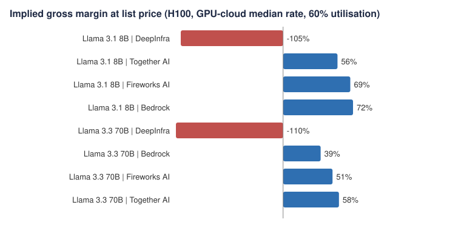
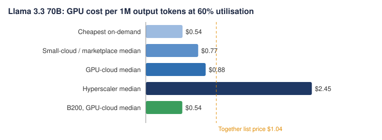

# AI inference economics: what it costs to serve an open LLM, and what hosts earn

**Tolu Oladuji** | October 2026 | [LinkedIn](https://www.linkedin.com/in/oladuji-tolulope/) | [Web version](https://oladujitolu-ai.github.io/ai-inference-economics/)

A fully sourced, self-updating model of LLM inference unit economics. It combines GPU rental prices from 22 providers (hyperscalers, GPU clouds, small clouds and marketplaces), published serving benchmarks and API list prices from big and small hosts, then works out the cost to serve a request, each host's implied gross margin and the GPU utilisation needed to break even. Every input is public and cited; see [`data/SOURCES.md`](data/SOURCES.md).

## Key findings

1. **Model size drives cost.** On a rented H100 at the GPU-cloud median rate ($3.99 an hour) and 60% utilisation, serving costs about $0.12 per million output tokens for Llama 3.1 8B and $0.88 for Llama 3.3 70B: roughly 7x more for the larger model.
2. **Where you rent matters as much as what you serve.** The same H100 rents for a median $3.49 an hour across 15 small GPU clouds and marketplaces, $3.99 at the larger GPU clouds and $11.06 on demand at AWS, Google Cloud and Azure. At the hyperscaler rate the 70B model costs $2.45 per million output tokens, above every host's list price, so nobody selling at these prices is renting hyperscaler capacity on demand.
3. **At list prices the economics work, if you fill the GPUs.** A host renting GPU-cloud H100s at 60% utilisation would earn implied compute gross margins of 56-72% on Llama 3.1 8B and 39-58% on Llama 3.3 70B at Together AI, Fireworks AI and Amazon Bedrock list prices. Break-even utilisation for 70B is only 25-37%, so the risk is idle capacity, not price.
4. **The long tail competes below big-host prices, and only new hardware makes that pay.** Across 21 providers and 36 offers on OpenRouter, smaller independent hosts price Llama 3.3 70B at a median $0.50 per million output tokens, against $0.72 at the big clouds. At those prices all 3 long-tail offers are below cost on rented H100s, even at small-cloud rates; on B200-class GPUs the same prices earn 18-39%. For small players, hardware generation is the business model.
5. **Next-generation hardware resets the cost curve.** On a B200 running FP4, 70B serving falls to $0.54 per million output tokens, 39% cheaper than on H100, even though the B200 rents for more ($7.49 an hour). Implied margins at the big hosts' prices rise to 63-74%.
6. **Open models have a price range, not a price.** gpt-oss-120b has 21 offers ranging from $0.17 to $0.95 per million output tokens, a 5.6x spread. The big hosts cluster at $0.60, the long tail undercuts them (median $0.42), and custom-chip providers charge the most (median $0.75), likely a premium for speed.
7. **Some prices sit below rented-GPU cost.** DeepInfra's Llama 3.3 70B Turbo price would need 126% utilisation of rented H100s to break even, which is impossible. That points to owned or contracted capacity, more aggressive optimisation (the Turbo variants are not defined on the pricing page), or market-share pricing.
8. **Closed models price on value, not cost.** Published prices for OpenAI, Anthropic and Google models span $0.10-$10 per million input tokens and $0.50-$50 per million output tokens, a 100x spread at the output price.





## The whole market: big and small providers

Every offer on OpenRouter for the same three models, costed on small-cloud / marketplace GPUs (the cheapest realistic rented capacity) at 60% utilisation.

| Model | Segment | Offers | Median $/1M out | Range | Median implied margin | Offers below cost |
|---|---|---|---|---|---|---|
| Llama 3.1 8B | hyperscaler / big cloud | 2 | $0.25 | $0.22-$0.29 | 75% | 0 |
| Llama 3.1 8B | custom chips | 1 | $0.08 | $0.08-$0.08 | 17% | 0 |
| Llama 3.1 8B | major independent host | 1 | $0.04 | $0.04-$0.04 | -80% | 1 |
| Llama 3.1 8B | long-tail independent host | 1 | $0.05 | $0.05-$0.05 | -54% | 1 |
| Llama 3.3 70B | hyperscaler / big cloud | 3 | $0.72 | $0.71-$2.25 | 46% | 0 |
| Llama 3.3 70B | custom chips | 2 | $0.84 | $0.79-$0.90 | 43% | 0 |
| Llama 3.3 70B | major independent host | 2 | $0.68 | $0.32-$1.04 | -11% | 1 |
| Llama 3.3 70B | long-tail independent host | 3 | $0.50 | $0.40-$0.52 | -7% | 3 |
| gpt-oss-120b | hyperscaler / big cloud | 4 | $0.39 | $0.17-$0.60 | 36% | 1 |
| gpt-oss-120b | custom chips | 3 | $0.75 | $0.60-$0.95 | 67% | 0 |
| gpt-oss-120b | major independent host | 4 | $0.55 | $0.17-$0.60 | 55% | 1 |
| gpt-oss-120b | long-tail independent host | 10 | $0.42 | $0.18-$0.75 | 30% | 2 |

## Implied margins at the major hosts' list prices

GPU-cloud median rate, 60% utilisation. Requests of 1,000 input + 1,000 output tokens, except gpt-oss-120b (output only).

| Model | Host | Host's model | List price $/1M (in / out) | Implied gross margin | Break-even utilisation |
|---|---|---|---|---|---|
| Llama 3.1 8B | DeepInfra | Meta-Llama-3.1-8B-Instruct-Turbo | $0.020 / $0.040 | -105% | 123% |
| Llama 3.1 8B | Together AI | Llama 3 8B Instruct Lite | $0.140 / $0.140 | 56% | 26% |
| Llama 3.1 8B | Fireworks AI | Size-based tier: 4B-16B parameters (e.g. Llama 3.1 8B) | $0.200 / $0.200 | 69% | 18% |
| Llama 3.1 8B | Amazon Bedrock | Llama 3.1 Instruct (8B) | $0.220 / $0.220 | 72% | 17% |
| Llama 3.3 70B | DeepInfra | Llama-3.3-70B-Instruct-Turbo | $0.100 / $0.320 | -110% | 126% |
| Llama 3.3 70B | Amazon Bedrock | Llama 3.3 Instruct (70B) | $0.720 / $0.720 | 39% | 37% |
| Llama 3.3 70B | Fireworks AI | Size-based tier: >16B parameters (e.g. Llama 3.3 70B) | $0.900 / $0.900 | 51% | 29% |
| Llama 3.3 70B | Together AI | Llama 3.3 70B | $1.040 / $1.040 | 58% | 25% |
| Llama 3.3 70B on next-gen B200 | DeepInfra | Llama-3.3-70B-Instruct-Turbo | $0.100 / $0.320 | -28% | 77% |
| Llama 3.3 70B on next-gen B200 | Amazon Bedrock | Llama 3.3 Instruct (70B) | $0.720 / $0.720 | 63% | 22% |
| Llama 3.3 70B on next-gen B200 | Fireworks AI | Size-based tier: >16B parameters (e.g. Llama 3.3 70B) | $0.900 / $0.900 | 70% | 18% |
| Llama 3.3 70B on next-gen B200 | Together AI | Llama 3.3 70B | $1.040 / $1.040 | 74% | 16% |
| gpt-oss-120b (MoE) | Together AI | gpt-oss-120B | $0.150 / $0.600 | 49% | 30% |
| gpt-oss-120b (MoE) | Fireworks AI | OpenAI GPT OSS 120B | $0.150 / $0.600 | 49% | 30% |
| gpt-oss-120b (MoE) | Groq | openai/gpt-oss-120b | $0.150 / $0.600 | 49% | 30% |
| gpt-oss-120b (MoE) | Amazon Bedrock | gpt-oss-120b | $0.150 / $0.600 | 49% | 30% |

## How it stays current

The project updates itself. One command (`python refresh.py`) pulls live per-provider prices from OpenRouter's public API, saves a dated snapshot, logs every price change against the previous run, then re-runs the model and rebuilds the Excel file, charts, this README and the web page. A GitHub Actions workflow runs it every Monday, so the numbers here stay current without manual work. Sources without a public feed (NVIDIA benchmark tables and some GPU price pages) stay as dated, cited inputs.

## Method

- **Serving cost per request** = GPU $/hour / (output tokens per second per GPU x 3,600 x utilisation) x output tokens
- **List price per request** = input tokens x input price + output tokens x output price
- **Implied gross margin** = 1 - serving cost / list price; **break-even utilisation** = utilisation at which cost equals price
- **GPU price tiers:** small GPU clouds and marketplaces, larger GPU clouds (Lambda, CoreWeave, RunPod, Together AI) and hyperscalers (AWS, Google Cloud, Azure), on-demand, one quote per provider.

## Limitations

- Compute only: the margins exclude staff, networking, storage, idle reserve capacity and sales costs, so true operating margins are lower.
- Throughput is NVIDIA TensorRT-LLM / MLPerf offline maximum-load output throughput, a ceiling. The utilisation assumption (base 60%, tested 30-90%) stands in for latency targets and uneven demand.
- GPU prices are on-demand list prices on 6 Oct 2026 (US regions where stated; two European clouds converted at the ECB rate). Hosts often pay less through reserved or owned capacity, so real margins can be higher than shown. Marketplace prices are live snapshots (median listing, never the lowest).
- The margins show what a host renting GPUs at list price would earn at each host's price. They are not any company's reported margins: Groq, SambaNova and Cerebras run their own chips, and several hosts may own hardware.
- OpenRouter prices are what each provider charges through OpenRouter, which can differ from its direct price. Providers are grouped into segments by judgement (see data/openrouter_to_csv.py).
- Fireworks lists Llama-class models under size-based tiers ($0.20 for 4-16B, $0.90 for dense models above 16B), used as its price for those models. gpt-oss-120b's benchmark does not state input/output lengths, so it is compared on output price only, which understates the margin.

## Run it

```
pip install openpyxl
python refresh.py     # fetch live prices, rebuild everything
python model.py       # or just re-run the model on the saved data
```

## Repository

- `data/`: input tables, live-price snapshots, price-change log and `SOURCES.md`
- `refresh.py`: the weekly refresh pipeline; `.github/workflows/refresh.yml`: the schedule
- `model.py`: the model; `build_site.py`: builds this README and the web page from the results
- `outputs/`: Excel model, results and charts

Preview-card photo: data center via [Unsplash](https://unsplash.com/s/photos/server-room?license=free) (Unsplash License).
